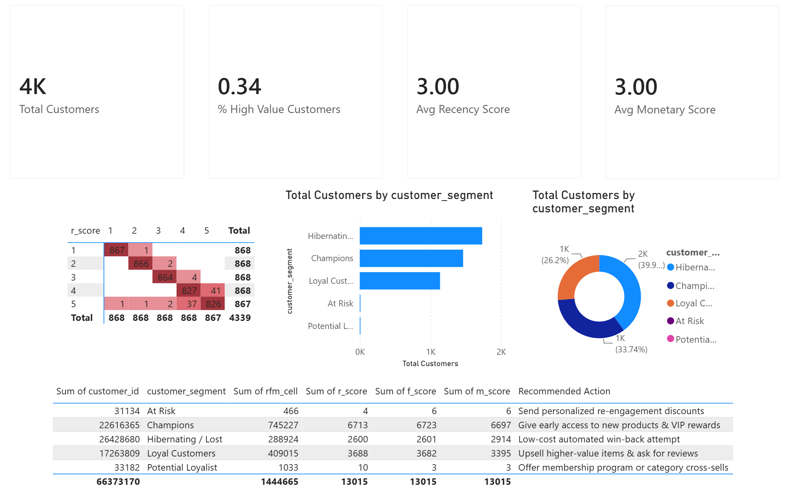

# RFM Customer Segmentation & Value Analysis

An end-to-end data analytics project leveraging SQL to segment an e-commerce customer base using Recency, Frequency, and Monetary (RFM) modeling, transforming raw transactional data into targeted marketing strategies.

---

## 🎯 Project Overview

In retail and e-commerce, treating all customers equally leads to wasted marketing spend and lower retention. For this project, I engineered a relational data pipeline in SQL (SQLite) to analyze historical purchasing behavior, score customers using quintile distributions, and classify them into actionable behavioral segments (e.g., Champions, At-Risk, Hibernating).

The goal of this analysis is to provide marketing teams with data-driven insights to optimize retention campaigns, maximize customer lifetime value (LTV), and target win-back strategies efficiently.

---

## 📊 The Dataset

* **Source:** Online Retail Dataset (UCI Machine Learning Repository via Kaggle).
* **Scope:** Transaction logs from a UK-based online retail company spanning 2010 to 2011.
* **Key Attributes:** `Invoice Number`, `Stock Code`, `Description`, `Quantity`, `Invoice Date`, `Unit Price`, `Customer ID`, and `Country`.

---

## 🛠️ SQL Methodology & Pipeline Architecture

I structured the SQL script as a modular, top-to-bottom data transformation pipeline using views to keep computations clean, reproducible, and easy to audit:

1. **Data Staging & Cleaning (`cleaned_transactions`):**
   * Filtered out null `CustomerID`s to ensure accurate individual tracking.
   * Removed anomalous rows (e.g., cancelled orders with negative quantities and erroneous pricing data).
   * Calculated total sales per line item (`Quantity * UnitPrice`).

2. **Base RFM Aggregation (`base_rfm`):**
   * **Recency:** Calculated the number of days between each customer's last purchase and a fixed snapshot date (`2011-12-10`).
   * **Frequency:** Counted the total number of unique invoices per customer.
   * **Monetary:** Computed the sum total spend per customer.

3. **Quintile Scoring (`scored_rfm`):**
   * Utilized the `NTILE(5)` window function to partition customers into scoring buckets from 1 to 5.
   * Applied proper sorting logic (ascending for Recency where lower days = higher score; descending for Frequency and Monetary where higher values = higher score).

   ```Snippet
    NTILE(5) OVER (ORDER BY recency_days ASC) AS r_score,
    NTILE(5) OVER (ORDER BY frequency DESC) AS f_score,
    NTILE(5) OVER (ORDER BY monetary DESC) AS m_score
   ```

4. **Behavioral Segmentation (`final_customer_segments`):**
   * Applied conditional `CASE` logic to combine individual scores into meaningful business tiers.

---

## 💡 Key Findings & Business Insights

* **The Pareto Principle in Action:** "Champions" (high recency, frequency, and monetary scores) represent a core fraction of the active base but drive a disproportionately high percentage of total revenue, confirming the need for VIP loyalty programs.
* **The "At-Risk" Segment:** The query successfully flagged high-value historical buyers who haven't made a purchase recently, providing marketing with a precise segment to target with win-back strategies.
* **Dormant Churn:** A significant cluster fell into the "Hibernating / Lost" tier, indicating that intervention is needed earlier in the customer journey to prevent drop-off.



---

## 📂 Repository Structure

```text
/rfm-customer-segmentation/
├── dashboard.png             # Dashboard visualization preview
├── README.md                 # Executive summary and documentation
├── rfm_analysis.sql          # Full, reproducible SQL script (Data cleaning -> Views -> Final output)
├── rfm_dashboard.pbix        # Dashboard visualization (Dashboard built using Power BI Desktop v.26.1.4.0)
├── dashboard.png             # Dashboard visualization preview
└── scored_rfm_preview.csv    # Sample export of final segment distributions

```

---

🚀 How to Run This Project
Clone this repository to your local machine:
```Bash
git clone [https://github.com/ZaneRoberts/rfm-customer-segmentation.git](https://github.com/ZaneRoberts/rfm-customer-segmentation.git)
```
Download the [Online Retail Dataset from Kaggle](https://www.kaggle.com/datasets/ulrikthygepedersen/online-retail-dataset) and import it into your SQL environment (e.g., DBeaver or SQLite) as a table named online_retail.

Open rfm_analysis.sql in your SQL GUI.

Execute the script from top to bottom to build the views and generate the customer segments, skipping the DROP statements if not needed.